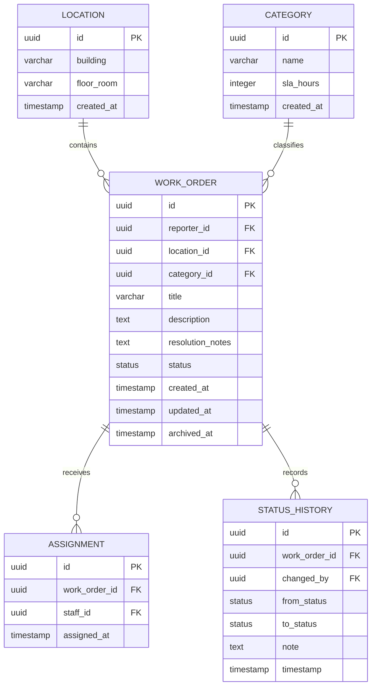

# Assignment #3: Database Design

## Project

Maintenance (Team 10)

## Contributors

- Person A: Backend, database, and API owner
- Person B: Document assembly and final review

## 1. Database Choice and Explanation

The project uses Supabase PostgreSQL as its database. PostgreSQL is suitable because the maintenance platform has related entities, foreign keys, status rules, audit history, and transaction requirements. Supabase provides a hosted PostgreSQL database, SQL tools, authentication integration, and a dashboard for inspecting data.

The team will use the Supabase dashboard or Supabase CLI to create and inspect the schema. Database changes must be stored in a versioned SQL migration file before they are applied to the remote database. The team will verify the remote tables, constraints, indexes, and relationships after deployment.

The Next.js API routes will authenticate the request, validate the input, apply the work-order business rules, and read or write data in Supabase PostgreSQL. Protected routes must enforce authorization on the server and must not rely only on client-side checks.

## 2. Database Schema

### Location

| Column | Type | Rules |
|---|---|---|
| `id` | UUID | Primary key |
| `building` | VARCHAR | Not null |
| `floor_room` | VARCHAR | Not null |
| `created_at` | TIMESTAMP | Not null, default current timestamp |

### Category

| Column | Type | Rules |
|---|---|---|
| `id` | UUID | Primary key |
| `name` | VARCHAR | Not null |
| `sla_hours` | INTEGER | Not null |
| `created_at` | TIMESTAMP | Not null, default current timestamp |

### WorkOrder

| Column | Type | Rules |
|---|---|---|
| `id` | UUID | Primary key |
| `reporter_id` | UUID | Not null, foreign key to the authenticated user identity |
| `location_id` | UUID | Not null, foreign key to `Location.id` |
| `category_id` | UUID | Not null, foreign key to `Category.id` |
| `title` | VARCHAR | Not null |
| `description` | TEXT | Not null |
| `resolution_notes` | TEXT | Nullable until resolution; required before `RESOLVED` |
| `status` | Work-order status | Not null, default `OPEN` |
| `created_at` | TIMESTAMP | Not null, default current timestamp |
| `updated_at` | TIMESTAMP | Not null, default current timestamp |
| `archived_at` | TIMESTAMP | Nullable; used for soft deletion |

Allowed work-order statuses are `OPEN`, `ASSIGNED`, `IN_PROGRESS`, `RESOLVED`, and `CLOSED`.

### Assignment

| Column | Type | Rules |
|---|---|---|
| `id` | UUID | Primary key |
| `work_order_id` | UUID | Not null, foreign key to `WorkOrder.id` |
| `staff_id` | UUID | Not null, foreign key to the authenticated staff identity |
| `assigned_at` | TIMESTAMP | Not null, default current timestamp |

### StatusHistory

| Column | Type | Rules |
|---|---|---|
| `id` | UUID | Primary key |
| `work_order_id` | UUID | Not null, foreign key to `WorkOrder.id` |
| `changed_by` | UUID | Not null, foreign key to the authenticated user identity |
| `from_status` | Work-order status | Nullable for the initial status entry |
| `to_status` | Work-order status | Not null |
| `note` | TEXT | Nullable |
| `timestamp` | TIMESTAMP | Not null, default current timestamp |

### Integrity Rules

- Required fields are not nullable.
- All entity relationships use foreign keys.
- Status changes must follow the valid lifecycle defined in the PRD.
- A work order cannot become `RESOLVED` without an assigned technician and non-empty resolution notes.
- A work order cannot become `CLOSED` unless its current status is `RESOLVED`.
- Assignment and status-history writes should occur in the same transaction as the related work-order update.
- Archiving sets `archived_at`; it does not physically delete the work order or its history.
- Duplicate active assignments for the same work order must be prevented by the database or transaction logic.

## 3. Entity-Relationship Diagram



`reporter_id`, `staff_id`, and `changed_by` refer to authenticated Supabase Auth user identities. The diagram shows the application-owned relationships; the Auth user table is managed by Supabase Auth.

## 4. Migration and Remote Database

### Migration file

- Migration file: `supabase/migrations/001_initial_schema.sql`
- API migration file: `supabase/migrations/002_api_policies_and_lifecycle.sql`
- Atomic lifecycle migration file: `supabase/migrations/003_atomic_create_and_start.sql`
- API test data migration file: `supabase/migrations/004_seed_api_test_data.sql`
- API test UUID correction migration file: `supabase/migrations/005_fix_api_test_uuid_values.sql`
- Migration date: `2026-09-20`
- Tool used: Supabase CLI against the linked hosted project
- Migration command: `npx supabase db push --linked`
- Seed command: `npx supabase db query --linked --file .\supabase\seed.sql`
- Execution result: Success; the hosted database reported that it was up to date.
- CLI migration status: Migrations `001` through `005` match between local and remote.
- Remote verification: Supabase Table Editor shows `assignments`, `categories`, `locations`, `status_history`, and `work_orders` in the `public` schema.

### Deployment evidence

The following verification has been completed:

1. The five tables appear in Supabase Table Editor.
2. A Table Editor screenshot was captured as deployment evidence.
3. The remote table names match this document and the ER diagram.
4. The hosted seed file was executed through the Supabase CLI without using Docker.

Do not include Supabase keys, passwords, JWTs, or other secrets in this document.

## 5. APIs and CRUD Demonstration

The API is implemented in `backend/app/api/work-orders` with Next.js App Router route handlers. The externally callable paths therefore include the `/api` prefix. A separate test client is available in `frontend/`. The examples below use redacted UUIDs and tokens; runtime request/response screenshots should be added during testing.

| Operation | Endpoint |
|---|---|
| Create | `POST /api/work-orders` |
| List | `GET /api/work-orders` |
| Read one | `GET /api/work-orders/{id}` |
| Update | `PATCH /api/work-orders/{id}` |
| Assign | `POST /api/work-orders/{id}/assign` |
| Start work | `POST /api/work-orders/{id}/in-progress` |
| Resolve | `POST /api/work-orders/{id}/resolve` |
| Close | `POST /api/work-orders/{id}/close` |
| Archive | `DELETE /api/work-orders/{id}` |
| History | `GET /api/work-orders/{id}/history` |

For each route, add the method, URL, relevant headers, request body, response status, response body, and an error example where applicable. Use redacted example IDs and tokens.

### API-console verification completed

The frontend API console was used with the hosted Supabase project. A signed-in Reporter account successfully sent `GET /api/work-orders`, and the backend returned `200 OK` with seeded work-order data. The remaining route examples and the complete lifecycle still require individual request/response evidence.

### Authentication Header

Protected requests use a Supabase Auth JWT. The token below is intentionally redacted:

```http
Authorization: Bearer <redacted-supabase-jwt>
Content-Type: application/json
```

### Create Work Order

```http
POST /api/work-orders
Authorization: Bearer <redacted-supabase-jwt>
Content-Type: application/json

{
    "location_id": "11111111-1111-1111-1111-111111111111",
    "description": "Water is leaking beside the second-floor laboratory.",
    "category_id": "22222222-2222-2222-2222-222222222222",
    "title": "Laboratory water leak"
}
```

```json
{
    "id": "33333333-3333-3333-3333-333333333333",
    "status": "OPEN",
    "title": "Laboratory water leak",
    "description": "Water is leaking beside the second-floor laboratory.",
    "created_at": "2026-09-20T10:00:00Z"
}
```

Expected success: `201 Created`. Missing fields should return `400 Bad Request`.

### List and Read Work Orders

```http
GET /api/work-orders?status=OPEN&location_id=11111111-1111-1111-1111-111111111111
Authorization: Bearer <redacted-supabase-jwt>
```

```json
{
    "data": [
        {
            "id": "33333333-3333-3333-3333-333333333333",
            "status": "OPEN",
            "title": "Laboratory water leak"
        }
    ]
}
```

```http
GET /api/work-orders/33333333-3333-3333-3333-333333333333
Authorization: Bearer <redacted-supabase-jwt>
```

```json
{
    "id": "33333333-3333-3333-3333-333333333333",
    "location_id": "11111111-1111-1111-1111-111111111111",
    "category_id": "22222222-2222-2222-2222-222222222222",
    "status": "OPEN",
    "archived_at": null
}
```

Expected success: `200 OK`. An unknown ID should return `404 Not Found`.

### Update Work Order

```http
PATCH /api/work-orders/33333333-3333-3333-3333-333333333333
Authorization: Bearer <redacted-supabase-jwt>
Content-Type: application/json

{
    "title": "Urgent laboratory water leak"
}
```

```json
{
    "id": "33333333-3333-3333-3333-333333333333",
    "title": "Urgent laboratory water leak",
    "status": "OPEN",
    "updated_at": "2026-09-20T10:05:00Z"
}
```

Expected success: `200 OK`. Unauthorized or invalid updates should return `401 Unauthorized` or `400 Bad Request`.

### Assign Work Order

```http
POST /api/work-orders/33333333-3333-3333-3333-333333333333/assign
Authorization: Bearer <redacted-staff-jwt>
Content-Type: application/json

{
    "staff_id": "44444444-4444-4444-4444-444444444444"
}
```

```json
{
    "work_order_id": "33333333-3333-3333-3333-333333333333",
    "staff_id": "44444444-4444-4444-4444-444444444444",
    "status": "ASSIGNED",
    "assigned_at": "2026-09-20T10:10:00Z"
}
```

Expected success: `200 OK`. A non-staff user should receive `403 Forbidden`.

### Resolve Work Order

```http
POST /api/work-orders/33333333-3333-3333-3333-333333333333/resolve
Authorization: Bearer <redacted-staff-jwt>
Content-Type: application/json

{
    "resolution_notes": "Replaced the damaged pipe and tested the water supply."
}
```

```json
{
    "id": "33333333-3333-3333-3333-333333333333",
    "status": "RESOLVED",
    "resolution_notes": "Replaced the damaged pipe and tested the water supply."
}
```

Expected success: `200 OK`. Missing assignment or resolution notes should return `400 Bad Request`.

### Close Work Order

```http
POST /api/work-orders/33333333-3333-3333-3333-333333333333/close
Authorization: Bearer <redacted-staff-jwt>
```

```json
{
    "id": "33333333-3333-3333-3333-333333333333",
    "status": "CLOSED",
    "closed_at": "2026-09-20T10:30:00Z"
}
```

Expected success: `200 OK`. Closing a work order that is not `RESOLVED` should return `400 Bad Request`.

### Archive Work Order

```http
DELETE /api/work-orders/33333333-3333-3333-3333-333333333333
Authorization: Bearer <redacted-staff-jwt>
```

```json
{
    "id": "33333333-3333-3333-3333-333333333333",
    "archived_at": "2026-09-20T10:35:00Z"
}
```

Expected success: `200 OK`. This is a soft delete; the row and its history remain stored.

### Status History

```http
GET /api/work-orders/33333333-3333-3333-3333-333333333333/history
Authorization: Bearer <redacted-supabase-jwt>
```

```json
{
    "data": [
        {
            "from_status": "OPEN",
            "to_status": "ASSIGNED",
            "note": null,
            "timestamp": "2026-09-20T10:10:00Z"
        },
        {
            "from_status": "IN_PROGRESS",
            "to_status": "RESOLVED",
            "note": "Replaced the damaged pipe and tested the water supply.",
            "timestamp": "2026-09-20T10:25:00Z"
        }
    ]
}
```

Expected success: `200 OK`. An unknown ID should return `404 Not Found`.

### Complete Work-Order Flow

Add verified evidence for this sequence:

`OPEN` -> `ASSIGNED` -> `IN_PROGRESS` -> `RESOLVED` -> `CLOSED`

The `IN_PROGRESS` step uses `POST /api/work-orders/{id}/in-progress` after assignment.

- Create response: documented above; replace with captured API output when implemented.
- Assignment response: documented above; replace with captured API output when implemented.
- Resolution response: documented above; replace with captured API output when implemented.
- Closure response: documented above; replace with captured API output when implemented.
- History response: documented above; replace with captured API output when implemented.

